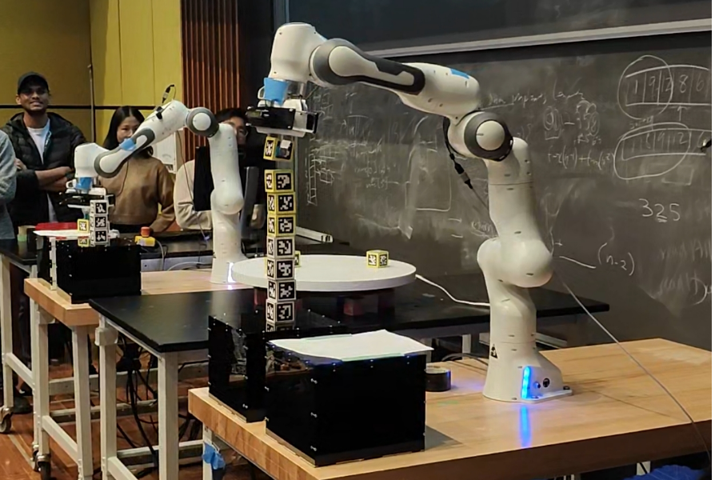

The project was the final competition of the Upenn course MEAM 5200 Introduction to Robotics instructed by Prof. [Nadia Figueroa](https://www.grasp.upenn.edu/people/nadia-figueroa/), and I led my team to **win the first place** with excellent and stable algorithms, and the attached video captures the winning moment. The project used the following techniques:

1. solve the position of an object in the world coordinate system based on the graphic coding information detected by the camera and the rigid-body transformation law;
2. a pose matching algorithm: i.e., it is always desired that the end effector grabs the wooden block in a certain pose (always with the camera facing forward);
3. trajectory planning algorithm: the RRT* algorithm is used for trajectory planning in Cartesian space, and the obstacle avoidance algorithm is specially developed for the robotic arm gripper jaws;
4. inverse kinematics solving and velocity tracking: numerical optimization is used to solve the inverse kinematics for the position and velocity of each path point on the trajectory;
5. speed feedback control: through the feedback control of the speed, tracking the path points, to realize the established grasping and placing targets.

|    |    |
